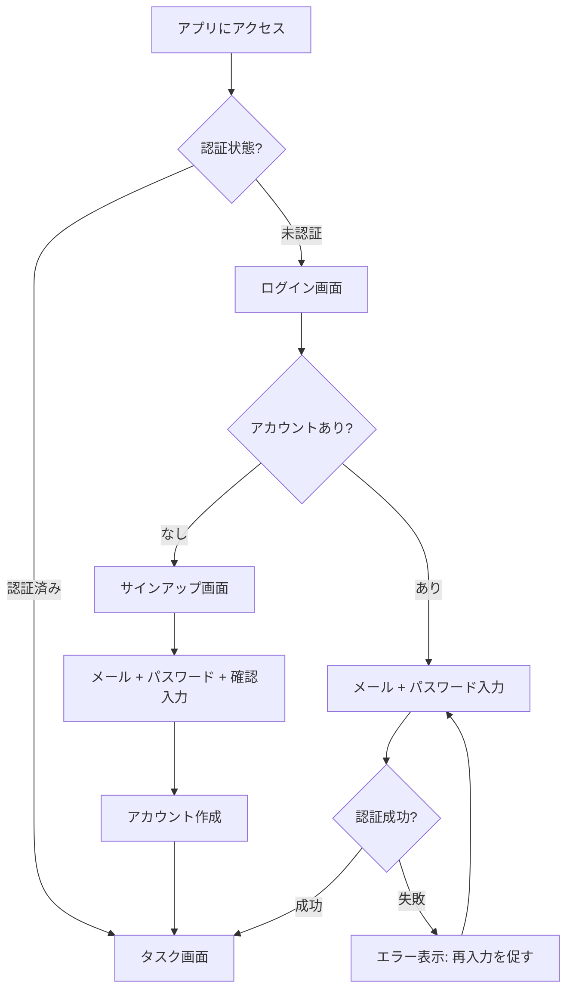
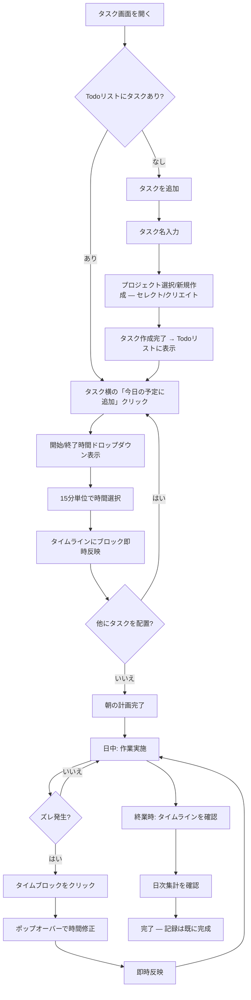
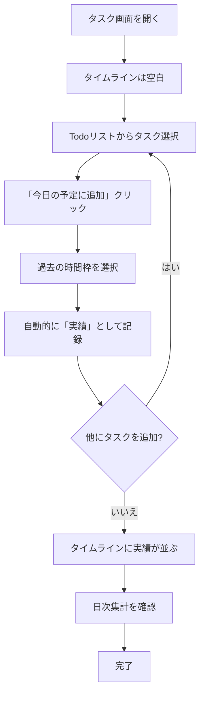
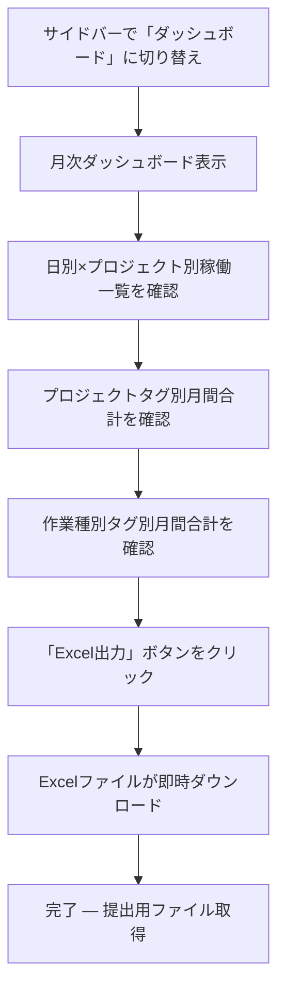

# UX Design Specification hr-time

**Author:** かいと
**Date:** 2026-03-13

---

## Executive Summary

### Project Vision

hr-timeは、日々の稼働時間の記録・分類・集計を自動化する計画編集型タイムボクシングWebアプリである。タイマー型ではなく「タイムラインにタスクブロックを配置して計画を立て、ズレたら修正する」アプローチにより、「計画＝記録」というパラダイムで記録のための記録を不要にする。月次Excel出力をワンクリックで完了し、日次稼働報告を15-30分から3分以内に短縮することを目指す。

### Target Users

プライマリユーザーは、複数案件を並行担当し月次でExcel稼働報告が必要なナレッジワーカー（エンジニア等）。技術リテラシーは高く、効率重視で余計な手順を嫌い、ツールに対する審美眼が高い。デスクトップ中心の利用。初期は個人利用、将来的にチーム展開を見据える。

### Key Design Challenges

1. **タイムラインUIの操作性** — 15分単位のブロック配置・編集がクリック操作だけで直感的に行えること。MVPではドラッグ操作なしでも「早い・楽」と感じられるインタラクション設計が必要
2. **計画/実績の遷移の自然さ** — 現在時刻基準の自動判定ロジックがユーザーに混乱を与えず、計画と実績の視覚的区別が直感的に伝わること。日付境界や深夜作業のエッジケースも考慮が必要
3. **後入力ケースのUX** — 計画なしで後から実績を入力するフロー（空白タイムラインからの開始）が自然で迷いなく行えること
4. **初日からの成功体験設計（Time to Value）** — 初回利用で「今日の記録がもう終わっている」と実感できる体験を設計し、継続利用の分岐点を確保する
5. **時間帯ごとの操作負荷の最適化** — 朝の計画は最小ステップ、日中のズレ修正は1クリック、終業時は確認のみ。ユーザーの感情カーブに合わせたUIの重さの調整

### Design Opportunities

1. **ゼロ負荷の記録体験** — 計画を配置するだけで記録が完了する軽さを、最小限の操作ステップと即時フィードバックで実現。同時に「記録されている実感」を視覚フィードバックで提供し、安心感を担保する
2. **月末の安心感** — ダッシュボードで常に集計状態が見え、ワンクリックExcel出力により月末作業の不安をゼロにする体験
3. **分類の認知負荷ゼロ** — プロジェクト配下のタスク作成でタグ自動付与。ユーザーが分類を意識せずに正確な集計が得られるUXパターン

### UI Layout Notes

- Todoリストは高さ固定のスクロールコンテナとし、プロジェクト数増加時にタイムライン側のビューポートを圧迫しない設計とする

## Core User Experience

### Defining Experience

hr-timeのコア体験は「Todoリストからタスクをタイムラインに配置する」操作に集約される。「今日の予定にする」→開始/終了時間選択→タイムライン反映という流れが、計画＝記録パラダイムの核心であり、この一連の操作が数クリックで完了することがプロダクト価値の根幹。

### Platform Strategy

- **プラットフォーム:** Web SPA（デスクトップ優先）
- **入力方式:** マウス＋キーボード中心。タッチ操作はMVP対象外
- **オフライン:** 不要。常時オンライン前提
- **ブラウザ:** Chrome, Safari, Edge, Firefox（最新2バージョン）

### Effortless Interactions

- **タスクのタイムライン配置:** 「今日の予定にする」→時間選択の2ステップで完了。迷いなく、考えずに操作できること
- **計画→実績の自動変換:** ユーザーが意識せず、時間経過で自動的に計画が実績に変わる。操作不要
- **タグの自動付与:** プロジェクト配下でタスク作成すれば分類完了。ユーザーは分類を意識しない
- **月次Excel出力:** ワンクリック。設定も確認画面も不要

### Critical Success Moments

1. **最重要（Make or Break）: タイムブロックの時間編集** — ブロックをクリックして開始/終了時間を15分単位で修正する操作。これが遅い・面倒と感じた瞬間、ユーザーはExcelに戻る。即座に反映され、直感的に正しい時間に調整できることが絶対条件
2. **初回成功体験:** 初めてタスクをタイムラインに配置し、「これだけで記録が終わる」と実感する瞬間
3. **終業時の安心:** タイムラインを一覧して「今日の作業が全て記録されている」と確認できる瞬間
4. **月末の解放:** Excel出力ボタンを押して数秒で提出用ファイルが手に入る瞬間

### Experience Principles

1. **記録は副産物** — ユーザーは計画を立てているだけ。記録のための操作は一切存在しない
2. **1クリックで完結** — すべての頻出操作は1クリック（最大2クリック）で完了する
3. **時間編集は瞬時** — タイムブロックの編集はUIの最重要インタラクション。100ms以内の応答、最小限の操作ステップ
4. **見れば分かる** — タイムラインを見るだけで今日の作業状況が把握できる。集計やステータスの確認に追加操作は不要

## Desired Emotional Response

### Primary Emotional Goals

- **安心感** — 一日のやることがタイムラインで可視化され、「全体が見えている」「記録できている」という安心感
- **集中** — 時間管理の手間が省けることで、タスクそのものに没頭できる。ツールが邪魔をしない透明な存在であること
- **解放感** — Excel手入力・集計という面倒な作業から解放された爽快さ

### Emotional Journey Mapping

| ステージ | 感じてほしい感情 |
|---------|----------------|
| 初回利用 | 「これだけでいいの？」という驚きと軽さ |
| 朝の計画 | さっと終わる気持ちよさ。負担ゼロ |
| 日中の修正 | 気軽さ。「ちょっと直すだけ」の軽い操作感 |
| 終業時の確認 | 安心感。「今日の記録はもう終わっている」 |
| 操作ミス時 | 「すぐ戻せるから大丈夫」という安全感 |
| 月末集計 | 解放感。「ワンクリックで終わった」 |
| 再訪時 | 自然に開く習慣感。ツールを使うことへの抵抗ゼロ |

### Micro-Emotions

- **自信 > 迷い** — 操作に迷わない。次に何をすればいいか常に明確
- **信頼 > 不安** — データが正しく記録されている実感。計画→実績の変換が自然で疑念が生じない
- **達成感 > 徒労感** — タイムラインが埋まっていく視覚的な充実感。「記録のための記録」という徒労感が一切ない

### Design Implications

- **安心感** → タイムラインの常時可視化。日次集計の常時表示。データが保存されたことの控えめなフィードバック
- **集中** → 操作ステップの最小化。モーダルやポップアップを極力排除。インライン編集で画面遷移なし
- **解放感** → 月次Excel出力の即時完了。確認ダイアログなしのワンクリック動作
- **安全感** → 編集操作のUndo対応。削除前の軽い確認（ただし煩わしくない程度）。タスク完了後のタイムブロック編集ロックで「うっかり壊す」不安を排除

### Emotional Design Principles

1. **ツールは空気** — 存在を意識させない。ユーザーの注意はタスクに向いていて、ツール操作に向かない
2. **見えることが安心** — タイムラインの可視化そのものが安心感の源泉。隠れた状態やモードを作らない
3. **ミスは怖くない** — すべての操作は簡単に元に戻せる。取り返しのつかない操作は存在しない
4. **静かなフィードバック** — 派手なアニメーションや通知ではなく、控えめで確実なフィードバックで信頼を積み重ねる

## UX Pattern Analysis & Inspiration

### Transferable UX Patterns

**カレンダー式タイムラインUI:**
- Googleカレンダーの縦時間軸レイアウト — 時間の長さ＝ブロックの高さという直感的なマッピング
- ブロックのクリック選択→インライン編集パターン

**2カラムレイアウト:**
- Todoリスト＋メインコンテンツの並列配置 — タスク管理ツールで広く採用される実績あるパターン
- 左パネルは情報源、右パネルは作業領域という認知モデル

**折りたたみグルーピング:**
- プロジェクト別の折りたたみ式リスト — ファイルエクスプローラー等で馴染みのあるパターン

### Anti-Patterns to Avoid

- **タイマー型の強制** — 記録開始/停止を忘れると記録が壊れるストレス。hr-timeは計画編集型でこれを回避
- **過剰なモーダルダイアログ** — 操作のたびに確認ポップアップが出るとツールが「重い」と感じる
- **複雑な初期設定** — 使い始める前にプロジェクト・カテゴリ・設定を大量に求めるオンボーディング

### Design Inspiration Strategy

**採用:** カレンダー式縦時間軸、2カラムレイアウト、折りたたみグルーピング
**回避:** タイマー強制、過剰な確認ダイアログ、重い初期設定

## Design System Foundation

### Design System Choice

**Tailwind CSS + shadcn/ui**（テーマブルシステム）

### Rationale for Selection

- **開発速度:** shadcn/uiの既製コンポーネントにより、フォーム・ボタン・ダイアログ等の標準UIを高速に構築可能
- **カスタマイズ性:** Tailwind CSSベースのため、タイムラインUIなどのカスタムコンポーネントも同じスタイリング体系で統一的に構築できる
- **1人開発に最適:** コピー&ペースト方式のコンポーネント所有モデルにより、依存関係が少なく管理が容易
- **React + Vite互換:** 技術スタックとの相性が良く、追加の設定コストが最小限
- **アクセシビリティ:** Radix UIベースでWCAG Level A準拠のアクセシビリティが標準搭載

### Implementation Approach

- shadcn/uiの標準コンポーネント（Button, Dialog, Select, Sidebar, Table等）をベースに構築
- タイムラインUI・タイムブロックはカスタムコンポーネントとして独自実装
- Tailwind CSSのデザイントークン（色、間隔、フォント）でプロジェクト全体の一貫性を担保

### Customization Strategy

- **カラーパレット:** プロジェクト別の色分け、計画/実績の視覚的区別に対応するカスタムカラー定義
- **コンポーネント拡張:** タイムブロック、休憩トグル、日次集計バー等のhr-time固有コンポーネントをTailwindベースで統一的に構築
- **テーマ:** ライトテーマのみ（MVPスコープ）

## Defining Core Experience

### Defining Experience

hr-timeの定義的体験は**「タスクをタイムラインに配置し、ズレたら時間を編集する」**操作。ユーザーが友達に説明するなら「計画を置くだけで稼働記録が終わるアプリ」。

### User Mental Model

- **現状:** Excelに事後で稼働時間を思い出しながら手入力。「何をやったか」「何時間か」を記憶に頼る苦痛
- **hr-timeのメンタルモデル:** 朝に計画を置く→日中ズレたら直す→終業時にはもう記録が完成している。記録は「計画の副産物」であり、独立した作業ではない
- **期待される認知:** タイムラインは「今日の作業の地図」。ブロックが並んでいること自体が記録の証拠

### Success Criteria

- タスクのタイムライン配置が**最短2クリック**で完了する（Todoリストから直接追加の場合）
- タイムブロックの時間編集が**クリック→ポップオーバー→選択**の1フローで完了する
- 操作後、タイムラインに即座に反映され、100ms以内のUI応答
- ユーザーが「操作方法を考える」瞬間が発生しない

### Novel UX Patterns

**組み合わせの革新:** 個々のパターンは既存（カレンダー式タイムライン、Todoリスト、ポップオーバー編集）だが、「計画＝記録」というパラダイムでの組み合わせが新しい。ユーザー教育は最小限で済む。

**馴染みのメタファー:**
- タイムライン → Googleカレンダーの日表示
- Todoリスト → 一般的なタスク管理アプリ
- ポップオーバー編集 → カレンダーアプリのイベント編集

### Experience Mechanics

**1. タスクのタイムライン配置（2つの導線）**

*ルートA — Todoリストから直接（最速）:*
- Todoリストのタスク横「今日の予定に追加」ボタンをクリック
- 開始/終了時間のドロップダウンが表示（15分単位）
- 時間選択 → タイムラインにブロックが即時反映

*ルートB — 詳細モーダル経由（確認してから追加）:*
- Todoリストのタスクをクリック → 詳細モーダル表示
- タスク内容を確認した上で「今日の予定に追加」ボタンをクリック
- 時間選択ドロップダウン → タイムラインに反映

**2. タスクの編集**

- 詳細モーダルから「編集」ボタンで編集モーダルに切り替え
- 編集可能項目: タスク名、詳細/メモ、時間変更、プロジェクト変更、タグ変更

**3. タイムブロックの時間編集（Make or Break）**

- タイムライン上のブロックをクリック
- ポップオーバーで開始/終了時間を15分単位で選択
- 変更即時反映。ポップオーバー外クリックで閉じる

**4. フィードバック**

- ブロック配置・編集時のスムーズなUI更新（100ms以内）
- 計画/実績の視覚的区別（色・透明度等）で状態が一目瞭然
- 日次集計が常時表示され、変更が即座に反映

## Visual Design Foundation

### Color System

**ベースカラー:**
- 背景: 青みがかった白（cool white / slate-50系）
- サーフェス（モーダル・カード）: 純白
- オーバーレイ: 半透明の暗色背景

**アクセントカラー:**
- プライマリ: 水色〜ライトブルー（sky-400〜sky-500系）。濃すぎない爽やかな青
- ボタン・リンク・選択状態に使用

**タスクカラーパレット:**
- プロジェクト別の色分け用にパステル系の淡いカラーバリエーションを用意
- タイムブロックの背景色として使用。テキストの可読性を確保するため薄めのトーン
- 計画ブロック: パステルカラー + やや透明度を加える
- 実績ブロック: パステルカラー（不透明）

**セマンティックカラー:**
- Success: 薄めのグリーン系
- Warning: 薄めのアンバー系
- Error: 薄めのレッド系
- 休憩ブロック: ニュートラルグレー系

### Typography System

**トーン:** カジュアルで親しみやすい

**フォント:**
- プライマリ: システムフォントスタック（-apple-system, "Hiragino Sans"等）またはInter / Noto Sans JP
- 日本語の可読性を重視したフォント選択

**タイプスケール:**
- 見出し: ゆったりとしたサイズ感。太さは medium〜semibold
- 本文: 読みやすいサイズ（14-16px）
- 補助テキスト（時間表示等）: 小さめだが判読可能（12-13px）
- 行間: 広め（1.5-1.7）でゆったりした印象

### Spacing & Layout Foundation

**スペーシング:** ゆったり志向
- ベースユニット: 8px
- コンポーネント間: 余白を多めに取り、圧迫感を排除
- カード・ブロック内: 十分なパディングで窮屈さを回避

**レイアウト:**
- 2カラム: 左Todoリスト（固定幅）+ 右タイムライン（残り幅）
- サイドバーナビゲーション: 左端にアイコンベースのナビ
- タイムラインの時間軸: 15分単位のグリッドライン（控えめな色）

**レイアウト原則:**
1. 余白は情報の整理手段 — 要素間の関係性を空間で表現する
2. 視線の流れは左→右 — Todoで選び、タイムラインで配置する自然な動線
3. 密度より可読性 — 情報を詰め込むより、ゆったり見やすく

### Accessibility Considerations

- WCAG Level A準拠
- パステルカラーのタスクブロック上のテキストはコントラスト比4.5:1以上を確保
- フォーカス状態の視覚的インジケーター（水色のアウトライン）
- キーボード操作でタイムブロックの選択・編集が可能

## Design Direction Decision

### Design Directions Explored

6つのデザインディレクションをHTMLモックアップで検証（`ux-design-directions.html`）:
1. Clean Minimal — 青みがかった白 + 水色アクセント
2. Warm Soft — 暖色系アンバー
3. Cool Professional — ダークサイドバー
4. Airy Pastel — 水色ベース全体
5. Compact Dense — 情報密度重視
6. Glassmorphism — すりガラス風透明感

### Chosen Direction

**Direction 1: Clean Minimal** を採用

### Design Rationale

- 青みがかった白ベースがビジュアル基盤で定義したcool white背景と一致
- 水色アクセントがhr-timeの「爽やかさ・軽さ」の感情ゴールに最適
- shadcn/uiのデフォルトスタイルに近く、実装コストが最小
- 余白を活かしたゆったりレイアウトがカジュアルなトーンと調和

### Design Refinements

選択時のフィードバックから以下を反映:

- **タイムライン表示範囲:** 8:00〜22:00を表示（PRDのデフォルト10:00-19:00から拡張し、早朝・夜間作業にも対応）
- **時間比例の縦幅:** タイムブロックの高さが実際の時間の長さに比例する。1時間ブロックと30分ブロックで視覚的に区別可能
- **時間表記:** 時間軸は「10:00」「11:00」形式。合計時間は「4.5時間」のように日本語「時間」表記を採用

## User Journey Flows

### Journey 0: 認証フロー

**エントリー:** 未認証状態でアプリにアクセス

**ポイント:**
- ログイン/サインアップは最小限のフィールド（メール + パスワード）
- 認証後は即タスク画面に遷移（初回でもチュートリアルなし — 空のタイムラインが最良のオンボーディング）

---

### Journey 1: 朝の計画→終業確認（メインフロー）

**エントリー:** 朝、ログイン済みでタスク画面を開く

**ポイント:**
- タスク追加時のプロジェクト選択はセレクト/クリエイト（既存選択 or 入力して新規作成）
- プロジェクト配下で作成するとタグ自動付与
- 独立した「プロジェクト追加」ボタンは不要 — プロジェクト作成はタスク追加時に統合
- 「今日の予定に追加」→時間選択の2ステップで配置完了
- 日中の修正はブロッククリック→ポップオーバーの1フロー

---

### Journey 2: 計画なしで後から実績入力（エッジケース）

**エントリー:** 夕方、計画を立てずに一日を過ごした後

**ポイント:**
- 計画なしでも操作フローは同一（「今日の予定に追加」→時間選択）
- 現在時刻より前の時間枠 = 自動的に実績判定
- 空白のタイムラインからでも迷わない（同じUIパターン）

---

### Journey 3: 月末集計レポート作成

**エントリー:** 月末、ダッシュボード画面

**ポイント:**
- ダッシュボードは閲覧のみ。編集操作なし
- Excel出力はワンクリック。確認ダイアログなし
- 日々の記録が正確なら、月末の作業はボタン1つ

---

### Journey Patterns

**共通パターン:**

| パターン | 適用箇所 | 説明 |
|---------|---------|------|
| セレクト/クリエイト | プロジェクト選択、タグ選択 | 既存を選択 or 入力してその場で新規作成（Notion風） |
| 2ステップ配置 | タスク→タイムライン | 「今日の予定に追加」→時間選択で完了 |
| クリック→ポップオーバー | タイムブロック編集 | ブロッククリックで即編集。外クリックで閉じる |
| 詳細→編集モーダル | タスク詳細の変更 | 詳細閲覧と編集を分離。誤編集を防止 |
| 自動判定 | 計画/実績の区別 | 現在時刻基準。ユーザー操作不要 |

### Flow Optimization Principles

1. **同一UIパターン** — 計画配置も実績入力も同じ操作フロー。学習コストゼロ
2. **段階的コミットメント** — タスク作成→タイムライン配置→時間調整の各段階で独立して完了可能
3. **エラーよりガイド** — 操作を制限するのではなく、自然な方向に誘導する（例: 過去の時間 = 実績として自動判定）
4. **ゼロステップ完了** — 月末集計は日々の蓄積の結果。月末に「作業」は発生しない

## Component Strategy

### Design System Components (shadcn/ui)

| コンポーネント | 用途 |
|--------------|------|
| Button | 各種アクションボタン（今日の予定に追加、Excel出力等） |
| Dialog | 詳細モーダル、編集モーダル、タスク追加モーダル |
| Popover | タイムブロック時間編集、タイムライン空白クリック時の選択肢 |
| Select | 時間選択ドロップダウン（15分単位） |
| Input | タスク名、メール、パスワード等のテキスト入力 |
| Sidebar | サイドバーナビゲーション（タスク画面 / ダッシュボード） |
| Table | 月次ダッシュボードの日別×プロジェクト別稼働一覧 |
| Toast | 操作完了通知、エラーメッセージの表示 |
| Collapsible | プロジェクト別折りたたみグループ |

### Custom Components

#### TimelineGrid（タイムラインUI）

**Purpose:** 1日の時間軸を可視化し、タイムブロックを配置する主要キャンバス
**Anatomy:**
- 縦時間軸: 8:00〜22:00、1時間刻みの目盛り
- グリッドライン: 1時間ごとの控えめな水平線
- ブロック配置エリア: タイムブロックと休憩ブロックを表示
- 日次集計バー: 下部にプロジェクト別の合計時間を常時表示（「時間」表記）
**Interaction:**
- 空白エリアクリック → ポップオーバー表示（「タスクを追加」/「休憩を追加」）
- クリックした時間帯が開始時間としてプリセット
**States:** 通常、ブロック選択中、ポップオーバー表示中

#### TimeBlock（タイムブロック）

**Purpose:** タイムライン上のタスク時間枠を表現するブロック
**Content:**
- タスク名
- プロジェクト名
- タグ（作業種別）
- 時間範囲（開始-終了）
**Anatomy:** 高さが実際の時間の長さに比例。左ボーダーにプロジェクトカラー
**States:**
- 計画: パステルカラー + 透明度 + 破線ボーダー
- 実績: パステルカラー（不透明）+ 実線ボーダー
- ホバー: 微小な右方向シフト
- 選択中: ポップオーバー表示
- 編集ロック: タスク完了時、グレーアウト + 編集不可
**Interaction:** クリック → ポップオーバーで開始/終了時間を15分単位で編集

#### BreakBlock（休憩ブロック）

**Purpose:** 休憩時間を表現し、稼働時間集計から自動除外
**Content:** 「休憩」ラベル + 時間範囲
**Anatomy:** ニュートラルグレー背景、タスクブロックと視覚的に区別
**States:** 通常、ホバー、選択中（時間編集用ポップオーバー）
**Interaction:** クリック → ポップオーバーで時間編集 or 削除

#### SelectCreate（セレクト/クリエイト）

**Purpose:** 既存項目の選択 or 新規作成を1つのUIで実現（Notion風）
**Usage:** プロジェクト選択、タグ選択
**Anatomy:**
- 入力フィールド（検索/フィルタ兼用）
- 既存項目のドロップダウンリスト
- 一致する項目がない場合「"入力値" を作成」オプションが表示
**States:** 未選択、フォーカス中（リスト展開）、選択済み、新規作成モード
**Interaction:** 入力開始でフィルタリング、クリックで選択、一致なしで新規作成を提示

#### ProjectGroup（プロジェクトグループ）

**Purpose:** Todoリスト内でプロジェクト別にタスクをグルーピング
**Anatomy:**
- プロジェクトカラードット + プロジェクト名 + 折りたたみアイコン
- 配下のタスクリスト
- プロジェクト配下の「+」アイコン（タスク追加、プロジェクトタグ自動付与）
**States:** 展開、折りたたみ
**Container:** 高さ固定のスクロールコンテナ内に配置

#### DailySummaryBar（日次集計バー）

**Purpose:** タイムライン下部にプロジェクト別の当日稼働時間を常時表示
**Content:** プロジェクトカラードット + プロジェクト名 + 稼働時間（「時間」表記）
**States:** 通常（タイムブロック編集に連動して即時更新）

### Component Implementation Strategy

**基本方針:**
- shadcn/uiコンポーネントを最大限活用し、カスタムコンポーネントはTailwind CSSで統一的にスタイリング
- カスタムコンポーネントもshadcn/uiのデザイントークン（色、間隔、角丸等）に準拠し、視覚的一貫性を担保
- Toastによるフィードバックを全操作に統一（追加成功、編集完了、エラー通知）

### Implementation Roadmap

**Phase 1 — コア（MVP必須）:**
- TimelineGrid + TimeBlock + BreakBlock（メイン画面の心臓部）
- SelectCreate（タスク・プロジェクト作成に必須）
- ProjectGroup（Todoリストの基本構造）
- DailySummaryBar（日次集計の常時表示）
- Toast（操作フィードバック）

**Phase 2 — 拡張:**
- ドラッグリサイズ対応のTimeBlock拡張
- グラフコンポーネント（ドーナツ/棒グラフ）

## UX Consistency Patterns

### Button Hierarchy

| レベル | スタイル | 用途例 |
|--------|---------|--------|
| Primary | 水色背景 + 白テキスト | 「今日の予定に追加」、「サインアップ」 |
| Secondary | 白背景 + 水色ボーダー | 「編集」、「タスクを追加」 |
| Ghost | 背景なし + テキストのみ | 「キャンセル」、折りたたみトグル |
| Destructive | 薄い赤背景 + 赤テキスト | 「削除」（タスク削除、ブロック削除） |
| Brand | 外部ブランドカラー | 「Excel出力」= Excel緑（#217346）+ Excelアイコン |

**ルール:**
- 1画面にPrimaryボタンは最大1つ（最も重要なアクションのみ）
- 破壊的操作（削除）は常にDestructiveスタイル
- 外部サービス連携ボタンはそのブランドカラーを使用

### Feedback Patterns (Toast)

| 種類 | 用途 | 表示時間 |
|------|------|---------|
| Success | タスク追加完了、タイムブロック配置、編集保存 | 3秒で自動消去 |
| Error | API通信エラー、バリデーション失敗、認証失敗 | ユーザーが閉じるまで表示 |
| Warning | タイムブロックの重複警告、未保存の変更 | 5秒で自動消去 |
| Info | ヒントや補足情報 | 3秒で自動消去 |

**ルール:**
- Toastは画面右上に表示
- 同時に最大3件までスタック表示
- Errorのみ手動で閉じる必要あり（見逃し防止）

### Modal & Popover Patterns

**モーダル（Dialog）— まとまった情報の表示・編集:**

| モーダル | トリガー | 内容 |
|---------|---------|------|
| タスク詳細 | Todoリストのタスクをクリック | タスク名、詳細/メモ、プロジェクト、タグ、タイムブロック一覧。「今日の予定に追加」ボタン、「編集」ボタン |
| タスク編集 | 詳細モーダルの「編集」ボタン | タスク名、詳細/メモ、プロジェクト変更（SelectCreate）、タグ変更（SelectCreate）、時間変更 |
| タスク追加 | Todoリストの「+」、タイムライン空白→「タスクを追加」 | タスク名、プロジェクト選択/新規作成（SelectCreate） |

**ルール:**
- 背景はオーバーレイ（半透明暗色）
- モーダルは白背景、角丸
- ESCキーまたはオーバーレイクリックで閉じる
- 編集中に閉じようとした場合、未保存の変更があればWarning Toastで通知

**ポップオーバー（Popover）— ピンポイントの素早い操作:**

| ポップオーバー | トリガー | 内容 |
|--------------|---------|------|
| 時間編集 | タイムブロックをクリック | 開始/終了時間のドロップダウン（15分単位）、削除ボタン |
| 空白選択 | タイムラインの空白をクリック | 「タスクを追加」「休憩を追加」の選択肢。クリック時間がプリセット |
| 時間選択 | 「今日の予定に追加」ボタン | 開始/終了時間のドロップダウン（15分単位） |

**ルール:**
- トリガー要素の近くに表示
- 外側クリックで閉じる
- オーバーレイなし（背景操作は視覚的にブロックしない）

### Form Patterns

**バリデーション:**
- リアルタイムバリデーション（入力中にフィードバック）
- エラーはフィールド直下に赤テキストで表示
- 送信ボタンはバリデーション通過後のみアクティブ化

**入力フィールド:**
- ラベルはフィールド上部に配置
- プレースホルダーはヒントとして使用（ラベルの代替にしない）
- フォーカス時に水色のアウトライン

### Navigation Patterns

**サイドバーナビゲーション:**
- アイコンベース（ラベルはホバーでツールチップ表示）
- アクティブ状態: 水色背景 + アイコン色変更
- 画面切り替え: タスク画面 ↔ ダッシュボード画面

**画面内ナビゲーション:**
- ダッシュボードの月切り替え: 前月/次月の矢印ボタン

### Empty States & Loading

**空の状態:**

| 画面 | 空の状態メッセージ | アクション |
|------|------------------|-----------|
| Todoリスト（初回） | 「タスクを追加して始めましょう」 | 「+」ボタンをハイライト |
| タイムライン（当日タスクなし） | 「今日の予定はまだありません」 | Todoリストからの追加を促す |
| ダッシュボード（データなし） | 「まだデータがありません。タスク画面で記録を始めましょう」 | タスク画面への導線 |

**ローディング:**
- スケルトンUI（コンテンツの形状をグレーのプレースホルダーで表示）
- タイムラインのブロック操作は楽観的更新（API応答を待たずUI即時反映）
- ローディングスピナーは全画面遷移時のみ（最小限に使用）

## Responsive Design & Accessibility

### Responsive Strategy

**MVPスコープ: デスクトップのみ**

- 最小対応幅: 1024px
- 最適表示幅: 1280px〜1920px
- タブレット・モバイル対応はPost-MVP検討

**デスクトップレイアウト:**
- サイドバーナビ（開閉式: 閉56px / 開200px）+ Todoリスト（300px固定）+ タイムライン（残り幅）
- サイドバーはデフォルト閉じ状態（アイコンのみ）。トグルボタンで開閉
- 画面幅が広い場合はタイムラインエリアが拡張

### Breakpoint Strategy

MVPではブレークポイント不要（デスクトップ単一レイアウト）。

**将来的なブレークポイント（Post-MVP）:**
- タブレット（768px〜1023px）: 2カラム→1カラム切り替え検討
- モバイル（〜767px）: 完全1カラム + ボトムナビ検討

### Accessibility Strategy

**準拠レベル: WCAG Level A**

**実装項目:**
- セマンティックHTML（header, nav, main, section等）
- キーボード操作: Tab/Shift+Tabでフォーカス移動、Enter/Spaceで操作、Escでモーダル/ポップオーバーを閉じる
- フォーカスインジケーター: 水色のアウトライン（全インタラクティブ要素）
- テキストコントラスト比: 4.5:1以上（パステルカラーのタスクブロック上テキスト含む）
- ARIA属性: モーダルにaria-modal、ポップオーバーにaria-expanded、タイムブロックにaria-label（タスク名+時間）
- 画像/アイコンにalt属性またはaria-label

### Testing Strategy

**アクセシビリティテスト:**
- 開発時にaxe-coreによる自動チェック
- キーボードのみでの全操作フロー確認

**ブラウザテスト:**
- Chrome, Safari, Edge, Firefox（最新2バージョン）
